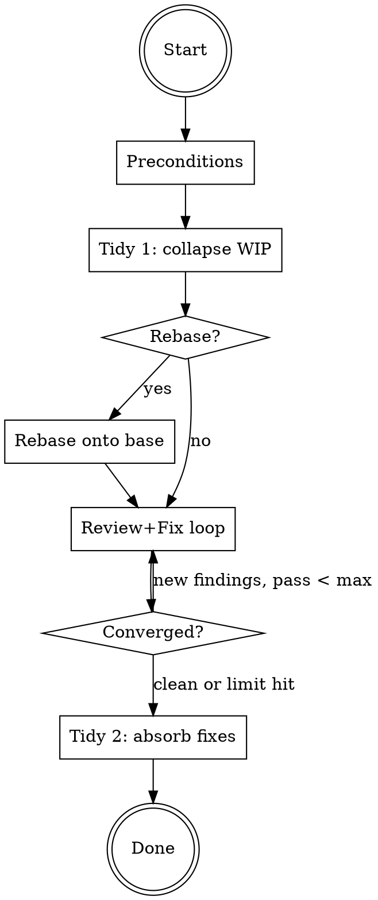

# Prep Branch

Make a feature branch look like code was written correctly the first time. Collapse WIP
noise, fix issues, produce a clean commit history a reviewer can read cold.

## Pipeline



## Arguments

Parse `$ARGUMENTS` for tokens:

| Token | Default | Effect |
|-------|---------|--------|
| `--rebase` | off | Rebase onto base branch after first tidy, before review loop |
| `--max-review-passes N` | 5 | Max iterations of review+fix loop |

Natural language triggers for rebase: "and rebase", "rebase first", "rebase onto main".

## Step 1: Preconditions

```bash
git status --porcelain
git symbolic-ref -q HEAD
```

Working tree must be clean. Must be on a branch (not detached HEAD). Stop if either fails.

## Step 2: Tidy 1 — Collapse WIP commits

Invoke the `git-tidy-branch` skill. This collapses messy WIP commits into logical,
atomic commits. Fewer commits = fewer conflict surfaces if rebasing next.

If branch already has clean history (single logical commits, no WIP), this is a no-op
and the skill handles it gracefully.

## Step 3: Rebase (conditional)

**Skip unless `--rebase` was requested** (explicitly or via natural language).

```bash
BASE=$(git for-each-ref --format='%(refname:short)' refs/heads/ | grep -E '^(main|master|develop|trunk)$' | head -1)
git fetch origin "$BASE"
git rebase "origin/$BASE"
```

If conflicts arise, attempt resolution. If conflicts require user judgment, stop the
pipeline and report which files conflict. User resolves manually, then re-invokes.

After successful rebase, verify tree compiles/passes smoke tests if the project has them.

## Step 4: Review + Fix loop

Run the `code-review` skill (or `/code-review --fix` if available) against the current
branch. This reviews code and applies safe fixes.

**Loop rules:**
1. Run review. If zero actionable findings, loop exits — branch is clean.
2. If findings exist and all can be auto-fixed without user input, apply fixes and loop.
3. If any finding requires user decision (ambiguous fix, architectural choice, design
   question), stop the loop and report to user. User decides, then re-invokes.
4. If loop hits `--max-review-passes` (default 5), stop and report remaining findings.
   Likely oscillating or deep issues that need human judgment.

Each pass commits fixes before the next review pass so the next review sees a clean diff.

## Step 5: Tidy 2 — Absorb fix commits

If the review loop produced any fix commits, invoke `git-tidy-branch` again.
This absorbs the fix commits back into the logical commits from Step 2, so the
final history shows no "fix review feedback" noise.

If no fix commits were created (review was clean on first pass), skip this step.

## Stop conditions

The pipeline stops early and reports to the user when:

- **Merge conflicts during rebase** that need human judgment
- **Review findings that need user decision** (not auto-fixable)
- **Review loop hits max passes** without converging
- **Tests fail** after rebase or after fixes

Always report what was completed and what remains.

## Example invocations

| User says | Behavior |
|-----------|----------|
| "clean up this branch" | Tidy → review+fix loop → tidy |
| "prep this branch and rebase" | Tidy → rebase → review+fix loop → tidy |
| "clean up this branch and rebase onto main" | Same as above |
| "prep for review" | Tidy → review+fix loop → tidy |
| "prep for merge --rebase" | Tidy → rebase → review+fix loop → tidy |
